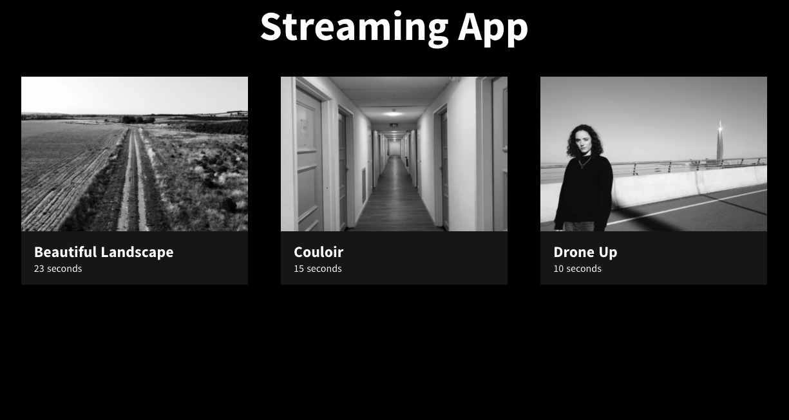
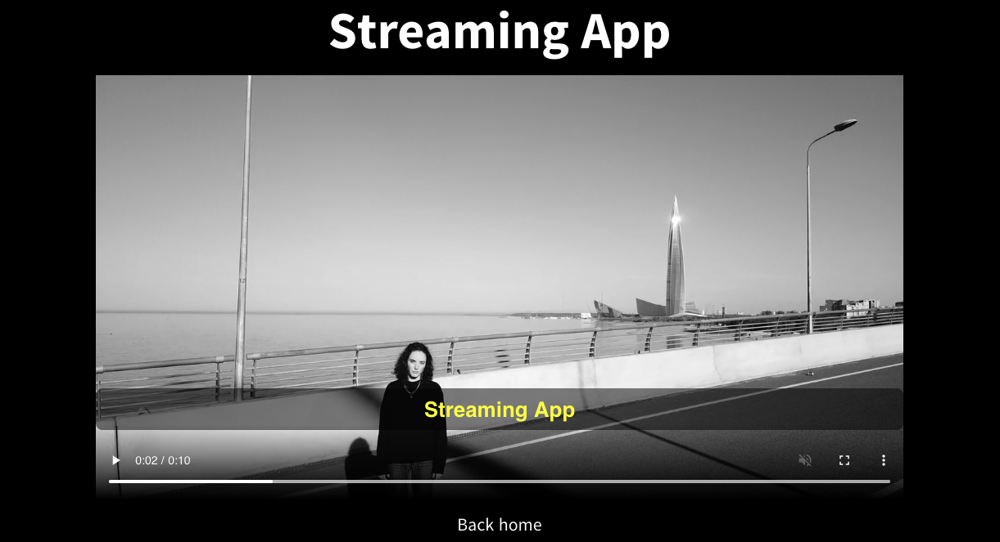

## Video Streaming App/ Nuxt.js, Node & Express

<p>Mises en place: </p>
<ul>
    <li>Créer un serveur Node.js</li>     
    <li>Streaming envoyant des chunks</></li>
    <li>Récupération des metadonnées</li>
    <li>Creation de sous-titre pour chaque vidéo</li> 
    <li>Consommation de notre API grace à Nuxt</li>
</ul>

<p>Perspectives d'amélioration:</p>
<ul>
    <li>Afficher dans la page player les métadonnées de chacune des video </li> 
    <li>Améliorer le design</li> 
</ul>

<p>Screenshot</p>



## Build Setup Local

<p>Frontend></p>

```bash
# install dependencies
cd frontend
$ npm install

# serve with hot reload at localhost:3000
$ npm run dev
```

<p>Backend></p>

```bash
# install dependencies
cd backend
$ npm install

# serve backend at localhost:5000
$ npm run start
```